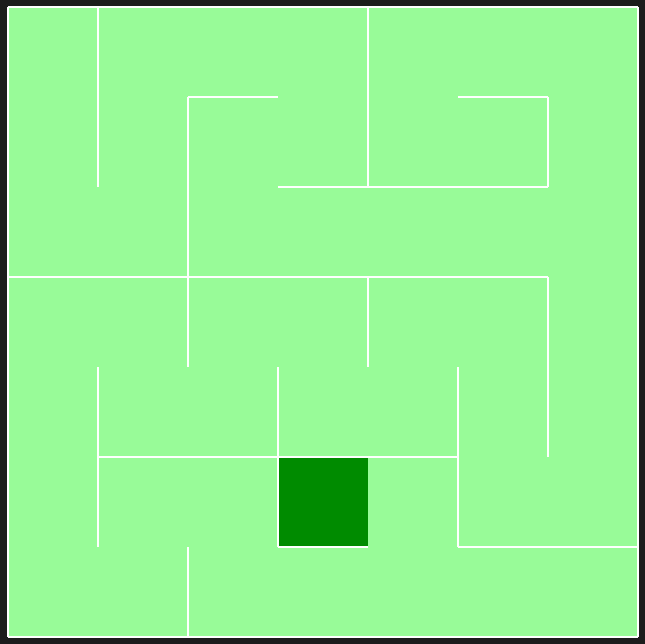
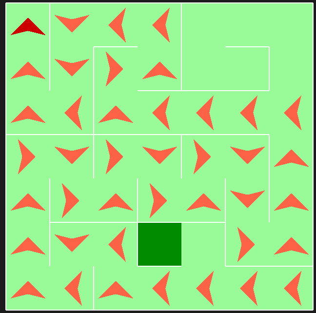
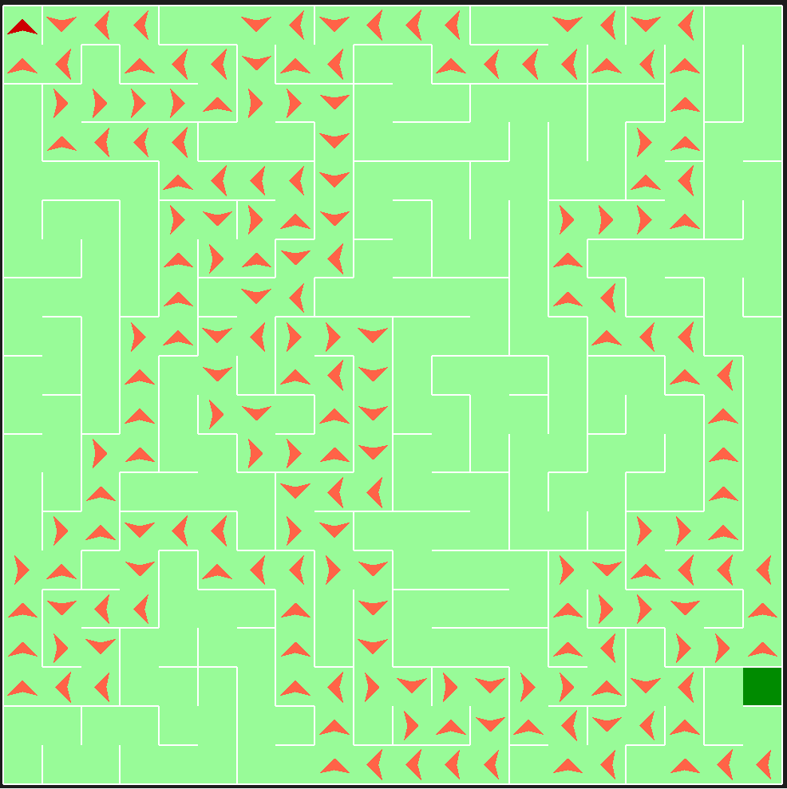

# Pyamaze with Depth First Search

## Introduction
This algorithm utulises the 'pyamaze' library to create and visualise the maze.

This is an algorithm that searches for the optimal path from the start cell to goal cell through depth-first search (DFS). 

It begins by mapping out the maze with a depth-first search method. Once it has found the goal, it will begin to trace back the path it took from the start and save that as the final path for the agent to traverse.

## Algorithm Maps Maze

## Algorithm Traverses Maze

## Algorithm Traversing a 20x20 Maze

## Code for algorithm
    start = (m.rows, m.cols)
    visited = [start]
    frontier = [start]
    dfs_path = {}
    all_cells = [start]
    maze_size = m.rows * m.cols
    
    while True:
        current = frontier.pop()
        if len(all_cells) == maze_size:
            break
        for direction in "NSEW":
            if m.maze_map[current][direction]:
                if direction == 'N':
                    child = (current[0] - 1, current[1])
                elif direction == 'S':
                    child = (current[0] + 1, current[1])
                elif direction == 'E':
                    child = (current[0], current[1] + 1)
                elif direction == 'W':
                    child = (current[0], current[1] - 1)
                if child in visited:
                    continue
                visited.append(child)
                frontier.append(child)
                if child not in all_cells:
                    all_cells.append(child)
                dfs_path[child] = current
    final_path = {}
    cell = (1, 1)
    while cell != start:
        final_path[dfs_path[cell]] = cell
        cell = dfs_path[cell]
    return final_path, visited